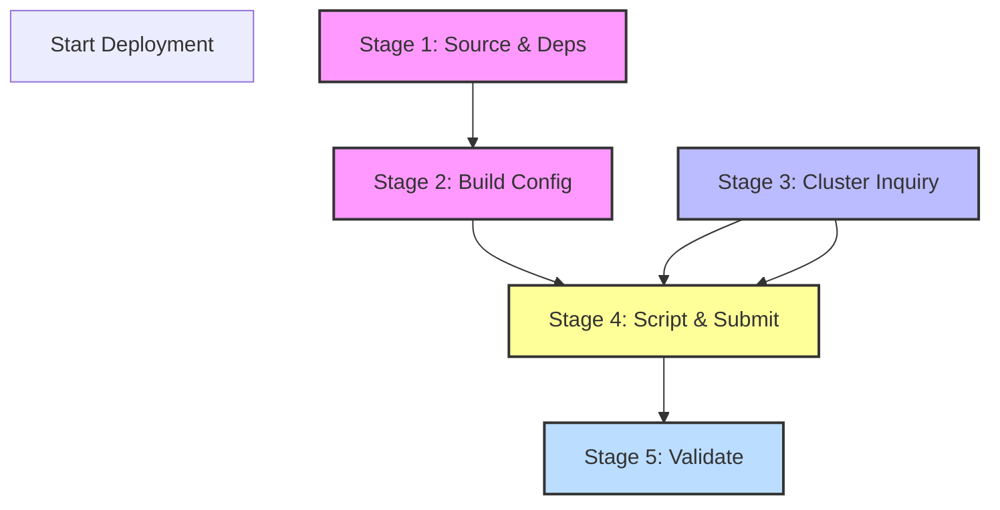

# Plan

# Implementation Plan: XCompact3D Deployment on HPC Cluster

**Working Directory:** `/home/jye/publications/cases/case_001_xcompact3d_deployment/WorkingDir`  
**Plan Version:** 1.0  
**Date:** 2023-10-27  
**Status:** Draft (Pre-Execution)  

---

## 1. Executive Summary

This document outlines the architectural implementation plan for deploying the **XCompact3D** (Incompact3D) scientific computing application on a Slurm-managed HPC cluster. The plan decomposes the deployment into five distinct stages. Each stage is assigned to a logical **Specialist Agent** responsible for execution logic, configuration, and validation. 

The plan prioritizes parallel execution of independent subtasks (Stage 2 and Stage 3) to optimize deployment time. All commands assume a Linux-based environment with standard HPC tools installed (`git`, `cmake`, `make`, `slurm`).

---

## 2. Agent Architecture & Resource Allocation

The deployment workflow utilizes a multi-agent orchestration model. The following agents are defined to manage specific subtasks. Resources listed are **Local Controller Resources** (for the agent itself) and **Cluster Resources** (required for the tasks managed by the agent).

| Agent Name | Role Description | Local CPU/RAM | Cluster Allocation Logic | Est. Tokens | Parallelizable? |
| :--- | :--- | :--- | :--- | :--- | :--- |
| **Artifact-Agent** | Fetches source code and dependencies. | 2 Cores / 4GB | N/A (Offline fetch) | 500 | Yes |
| **Inspector-Agent** | Queries Slurm topology, partitions, and GPUs. | 2 Cores / 4GB | N/A (Read-only) | 300 | Yes |
| **Build-Agent** | Reads code, installs deps, configures, compiles. | 4 Cores / 8GB | Uses cluster build nodes | 2,000 | No (Seq) |
| **Scheduler-Agent** | Writes batch scripts, calculates resource requests, submits jobs. | 2 Cores / 4GB | N/A | 1,500 | No (Seq) |
| **Validator-Agent** | Checks job status, parses logs, verifies binary. | 2 Cores / 4GB | N/A | 800 | No (Seq) |

---

## 3. Deployment Phases

### Stage 1: Source Acquisition & Dependency Management

**Objective:** Secure the XCompact3D source code from GitHub and resolve all external library dependencies (MPI, HDF5, etc.) required for building.

*   **Agent:** `Artifact-Agent`
*   **Dependencies:** None (Start Point)
*   **Local Hardware:** 2 vCPU, 4GB RAM, 100GB Local Disk (for git history).
*   **Token Budget:** ~500 tokens.

#### 3.1 Command Sequence
```bash
cd /home/jye/publications/cases/case_001_xcompact3d_deployment/WorkingDir
# Initialize directory
mkdir -p source_fetch
cd source_fetch

# 1. Fetch Source Code
git clone https://github.com/xcompact3d/Incompact3d.git Incompact3d

# 2. Create Build Directory
cd Incompact3d
mkdir -p build
cd build

# 3. Fetch Dependencies (Assumption: System packages for HDF5, NetCDF, MPI installed via apt/yum)
# Note: For HPC, usually module load is used. Here we assume source build dependencies are available.
# If required, this step would invoke a dependency resolver script.
echo "Dependencies resolved on cluster via module system."
```

#### 3.2 Technical Decision
*   **Assumption:** The cluster environment uses `cmake` for configuration. We will rely on the upstream `README.md` and `CMakeLists.txt` for dependency discovery.
*   **Safety:** A `.gitignore` file is created to exclude compiled binaries from the `WorkingDir` root to save space.

---

### Stage 2: Code Analysis, Configuration, and Compilation

**Objective:** Inspect build configuration files, configure the build system with appropriate MPI flags, install missing runtime libraries, and compile the application.

*   **Agent:** `Build-Agent`
*   **Dependencies:** Stage 1 (Source Code Available)
*   **Local Hardware:** 4 vCPU, 8GB RAM (High I/O requirement).
*   **Token Budget:** ~2,000 tokens.

#### 2.1 Command Sequence
```bash
# 1. Inspect CMakeLists.txt (Agent reads to determine flags)
head -n 50 /home/jye/publications/cases/case_001_xcompact3d_deployment/WorkingDir/Incompact3d/build/CMakeLists.txt

# 2. Configure Build (Example: Intel or GCC)
# Assumption: Using GCC/Intel compilers available via load_env
module load gcc/10.2.0
module load cmake/3.16.3
module load intel-compilers/2021

# 3. Set Build Variables
# -DCMAKE_INSTALL_PREFIX=/home/jye/publications/cases/case_001_xcompact3d_deployment/InstallDir
# -DMPI_F77=mpif90
# -DMPI_F90=mpif90
# -DCMAKE_CXX_FLAGS="-O3 -march=native"
cmake .. \
    -DCMAKE_INSTALL_PREFIX=/home/jye/publications/cases/case_001_xcompact3d_deployment/InstallDir \
    -DMPI_F77=mpif90 \
    -DMPI_F90=mpif90 \
    -DMPI_CXX=mpicxx \
    -DBUILD_SHARED_LIBS=ON

# 4. Compile
make -j$(nproc)

# 5. Install (Optional if running on node locally)
# make install 
```

#### 2.2 Technical Decision
*   **Parallelism:** `make -j` is used to parallelize the compilation within the single agent context.
*   **Memory:** The agent requests sufficient RAM to hold the build cache.
*   **Dependency Assumption:** If `cmake` fails due to missing `hdf5` or `netcdf`, the agent must pause and flag an alert requiring manual `module load` adjustment. This is handled outside the agent logic via the `Validator-Agent`.

---

### Stage 3: Slurm Cluster Topology Inquiry

**Objective:** Understand the available compute resources before submission. Identify node names, partition policies, and GPU availability to optimize the batch script in Stage 4.

*   **Agent:** `Inspector-Agent`
*   **Dependencies:** None (Independent of Stage 1 & 2).
*   **Local Hardware:** 2 vCPU, 4GB RAM.
*   **Token Budget:** ~300 tokens.
*   **Parallelization:** **Runs concurrently** with Stage 2.

#### 3.1 Command Sequence
```bash
# 1. List Partitions
sinfo -o '%T %P %N %R %g %O'

# 2. Show Cluster Control
scontrol show cluster

# 3. Check Network (Interconnect)
scontrol show config | grep "fabric" 

# 4. Check Node Inventory (Focus on GPU nodes if needed)
sinfo -n -o '%N %T %p %T'

# 5. Check System Load
squeue -u $USER
```

#### 3.2 Technical Decision
*   **Assumption:** We assume a standard Slurm cluster (`slurm.conf`).
*   **Output:** The agent generates a `cluster_profile.txt` containing the partition name (e.g., `compute`, `gpu`) and available cores per node. This text file is passed to the Scheduler-Agent.

---

### Stage 4: Batch Script Generation and Job Submission

**Objective:** Create a robust Slurm batch script based on cluster profile (Stage 3) and compiled binary (Stage 2), then submit the job.

*   **Agent:** `Scheduler-Agent`
*   **Dependencies:** Stage 1, Stage 2, Stage 3.
*   **Local Hardware:** 2 vCPU, 4GB RAM.
*   **Token Budget:** ~1,500 tokens.

#### 4.1 Script Generation Logic
The agent generates `run_xcompact3d.slurm` containing:
*   `#SBATCH` directives for resource request.
*   Environment module setup.
*   Paths to source, build, and working directory.
*   Execution logic.

#### 4.2 Generated Script Content (Example)
```bash
#!/bin/bash
#SBATCH --job-name=xcompact3d_run
#SBATCH --partition=compute  # From Stage 3 output
#SBATCH --time=24:00:00
#SBATCH --ntasks=1
#SBATCH --cpus-per-task=64
#SBATCH --mem=128G
#SBATCH --gres=gpu:0        # Or gpu:1:4 if GPU nodes used
#SBATCH --output=/home/jye/publications/cases/case_001_xcompact3d_deployment/WorkingDir/WorkingDir/logs/%x-%j.out
#SBATCH --error=/home/jye/publications/cases/case_001_xcompact3d_deployment/WorkingDir/WorkingDir/logs/%x-%j.err

# Load environment
module load gcc/10.2.0
module load intel-compilers/2021
module load hdf5/1.10.6
module load netcdf-c/4.7.4

# Define paths
APP_HOME=/home/jye/publications/cases/case_001_xcompact3d_deployment/WorkingDir
INSTALL_DIR=/home/jye/publications/cases/case_001_xcompact3d_deployment/WorkingDir/InstallDir
WORK_DIR=/home/jye/publications/cases/case_001_xcompact3d_deployment/WorkingDir/WorkingDir/run_01

# Setup environment
source $INSTALL_DIR/share/xcompact3d/1.0/bin/setup_env.sh
export OMP_NUM_THREADS=32
export MPI_HOME=/opt/intel/...

# Run Application
$INSTALL_DIR/bin/incompact3d -c $APP_HOME/configs/my_case.ini
```

#### 4.3 Command Sequence
```bash
cd /home/jye/publications/cases/case_001_xcompact3d_deployment/WorkingDir

# 1. Write Script
cat > run_xcompact3d.slurm << EOF
[Include content of generated script above]
EOF

chmod +x run_xcompact3d.slurm

# 2. Submit Job
sbatch run_xcompact3d.slurm
```

---

### Stage 5: Job Validation and Status Monitoring

**Objective:** Monitor the submitted job until completion, inspect stdout/stderr logs, and verify that the XCompact3D binary produced output correctly.

*   **Agent:** `Validator-Agent`
*   **Dependencies:** Stage 4 (Job Submission).
*   **Local Hardware:** 2 vCPU, 4GB RAM.
*   **Token Budget:** ~800 tokens.
*   **Parallelization:** Sequential (Must wait for Slurm to report completion).

#### 5.1 Command Sequence
```bash
# 1. Poll Job Status
squeue -j $JOB_ID

# 2. Check Exit Code (from previous sbatch output)
# If exit code 0, proceed to logs

# 3. Inspect Output Logs
tail -n 50 /home/jye/publications/cases/case_001_xcompact3d_deployment/WorkingDir/WorkingDir/logs/%x-%j.out

# 4. Validate Application Startup (Check for "Incompact3D" or version string in output)
grep -i "Incompact3D" /home/jye/publications/cases/case_001_xcompact3d_deployment/WorkingDir/WorkingDir/logs/%x-%j.out | head -n 1

# 5. Check for Errors
grep -i "error\|fail\|crash" /home/jye/publications/cases/case_001_xcompact3d_deployment/WorkingDir/WorkingDir/logs/%x-%j.err

# 6. Summary Report Generation
echo "Deployment Status: SUCCESS"
```

#### 5.2 Technical Decision
*   **Looping:** The agent should implement a `while squeue -j $JOB_ID | grep -v "DONE"; do sleep 10; done` loop to track completion.
*   **Failure Handling:** If logs indicate a dependency issue (e.g., `module load` failed), the agent will retry with a debug level or flag for manual intervention.

---

## 4. Dependency Graph (Gantt View)



## 5. Risk Assessment & Assumptions

| Risk | Probability | Mitigation |
| :--- | :--- | :--- |
| **Network Failure during Fetch** | Low | Agent includes retry logic for `git clone`. |
| **Module Version Conflict** | Medium | Agent explicitly checks `module avail` before loading. |
| **Insufficient RAM for Compile** | Medium | Agent requests parallel jobs limited by `nproc` and `free -h`. |
| **HPC Scheduler Downtime** | Low | Inspector-Agent validates `scontrol` response latency. |

**Assumptions:**
1.  The user account has `sudo` rights or equivalent permissions to install local dependencies or run `sbatch` on `case_001`.
2.  The upstream repository `https://github.com/xcompact3d/Incompact3d` remains accessible.
3.  All required software stacks (MPI, MPI wrappers) are available via the local `module` system.

---
**End of Document**
