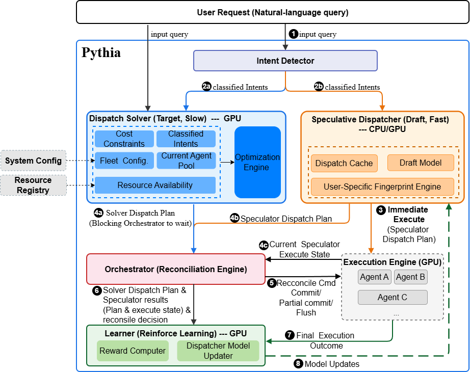
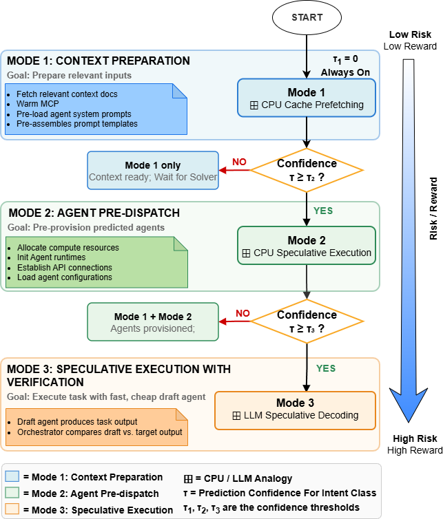

# 3. Speculative Dispatch

This section presents the Speculative Dispatch framework: the five-layer architecture, the three progressive speculation modes, the reconciliation protocol, the formal cost model, and the resource-aware dispatch formulation.

## 3.1 Architecture Overview

The Speculative Dispatch pipeline consists of five components with well-defined data contracts (Figure 1).

**Intent Detector.**
A lightweight classifier that transforms a natural-language user request into a structured intent representation: task type, estimated complexity, domain tags, decomposability score, and constraint annotations.
The Intent Detector is deliberately shallow in order to perform fast classification not planning.
We implement it as a rule-based classifier rather than a learned model to ensure deterministic, sub-millisecond classification latency since the Intent Detector must never become a bottleneck that offsets speculation gains.
Its structured output together with the raw user request are fed to both the Dispatch Solver and the Speculative Dispatcher in parallel.

**Dispatch Solver (Target).**
The full optimization engine that computes the optimal dispatch plan given the complete system state: all classified intents, the current agent pool, fleet configuration, resource availability, and cost constraints.
The Solver produces a `DispatchPlan` — a structured specification of which agents to invoke, on which resources, with what prompts, in what execution order, and under what budget constraints.
Solver latency is the bottleneck that speculation aims to hide.
The Solver will select the dispatch plan that minimizes a cost-latency objective subject to the resource and budget constraints formalized in §3.5.

**Speculative Dispatcher (Draft).**
A lightweight prediction model that runs in parallel with the Solver.
It produces a draft dispatch plan using pattern matching on intent classifications, a historical dispatch cache, and a learned user-specific fingerprint maintained by the Learner.
Upon generating its prediction, the Speculative Dispatcher immediately begins pre-execution steps according to the active speculation mode.

<!-- Questions to clarify before rewrite: 
1) What does "pattern matching on intent classifications" actually mean? A reader can't reproduce or evaluate this. Is it a lookup table? A nearest-neighbor search? A decision tree? 
2) What is the "historical dispatch cache"? What's cached — full plans? Agent assignments? What's the eviction policy? What's the key?
3) What is the "learned user-specific fingerprint"? 
   Based onn explaination in section 4.1, it is a compressed representation of the user's recent dispatch history, correct?
4) What does the Speculative Dispatcher output? The Solver produces a DispatchPlan. Does the Speculative Dispatcher produce the same data structure? If so, say it. If not, explain why.
5) We mentioned Latency characterization. You say $L_{spec} \ll L_s$ in §3.4 but never justify why the Speculative Dispatcher is fast. The Intent Detector gets "sub-millisecond" — what's the Dispatcher's target?  

------------------------------
1. Mode 3 draft execution: Does the Speculative Dispatcher run a cheap model to produce actual output, or just predict the dispatch plan? This determines whether Mode 3 is in scope for the prototype.                                                                               
  2. Plan prediction mechanism: Is cache lookup sufficient, or should the Learner's RL policy replace it as the prediction engine?
  3. Scope of the evaluation: Will §6 evaluate all three modes or just Modes 1-2? 
-->

**Orchestrator (Reconciliation Engine).**
Receives both the Solver's optimal plan and the Speculative Dispatcher's pre-executed work.
Performs reconciliation: comparing the two plans element-by-element and issuing one of three verdicts — COMMIT, PARTIAL COMMIT, or FLUSH — before executing the final dispatch.
<!-- Questions to answer before we rephrase/clarify
1. When does reconciliation trigger? When the Solver finishes? What if the Solver finishes before the Speculative Dispatcher has done anything useful? 
2. How is element-by-element comparison done? What are the "elements"? Agent identity? Agent+prompt? Agent+prompt+context? The granularity of comparison determines what PARTIAL COMMIT means in practice.
3. What happens to in-flight speculative work during reconciliation? Is execution paused? Does it continue optimistically until the verdict?
4. Timing relationship. The Orchestrator sits between two parallel paths with different completion times. The control flow here is non-trivial — describe it.

For the Orchestrator:
  1. What event triggers reconciliation — Solver completion?
  2. What's the comparison granularity — per-agent? per-subtask?
  3. What happens to in-flight speculative work while reconciliation runs?
  4. Does the Orchestrator have any state, or is it purely reactive?

Notes:
1. Trigger: Reconciliation begins when the Solver completes
2. Comparison granularity

  Your implementation in comparison.py line 27 is clear: comparison is per-assignment, where a match is defined as the same (agent_type, fleet_member_id) pair. So the granularity is: "same agent on same infrastructure node."

  This is described nowhere in the paper. §3.3 says "element-by-element" but never defines what an "element" is. You should state this explicitly — it's a design decision that matters for the salvage ratio calculation.

  Note one subtlety your code handles but the paper doesn't discuss: COMMIT requires matches == len(p_hat.assignments) AND matches == len(p_star.assignments) (line 49). This means COMMIT requires the plans to be identical in size, not just that $\hat{P} \subseteq P^*$. That's
  worth stating.

  3. Pausing in-flight work

  Your intuition makes sense, but think about when and what gets paused:

  - Mode 1 work (context preparation): No reason to pause — context is agent-agnostic, useful regardless of verdict.
  - Mode 2 work (agent provisioning): Pausing mid-provisioning is awkward. By the time the Solver finishes, provisioning is likely either done or nearly done. Does it make sense to let it complete and then decide what to keep vs discard?
  - Mode 3 work (draft execution): This is where pausing matters. The draft agent is producing output — do you stop it immediately when the Solver returns, or let it finish the current generation step?

  The CPU analogy helps here: in speculative execution, the pipeline doesn't pause — it continues until the branch resolves, then either commits or flushes. Your Orchestrator could work the same way: let speculative work continue until reconciliation completes, then commit or
  flush. This is simpler to implement and avoids the complexity of a pause/resume protocol.

  4. Orchestrator state

  Good question. Look at what your ReconciliationEngine currently is: stateless (line 49-58). It takes inputs, produces an output, done. But you're right that a real Orchestrator needs state. Think about what it needs to track:

  What state?
  - Which speculation mode is active for the current request
  - References to in-flight speculative work (so it can commit or flush them)
  - The Solver's completion status (has $P^*$ arrived yet?)

  What states (lifecycle)? Think of it as a simple state machine per request:

  IDLE → SPECULATING → RECONCILING → EXECUTING → DONE

  - IDLE: Waiting for a request
  - SPECULATING: Speculative Dispatcher is running, Solver is running in parallel. Orchestrator holds references to both.
  - RECONCILING: Solver returned $P^*$. Orchestrator is comparing plans and deciding the verdict.
  - EXECUTING: Verdict issued. Committed work proceeds, flushed work is cleaned up, redirected agents are re-initialized.
  - DONE: Execution complete. Outcome sent to Learner.

  Right now your ReconciliationEngine only covers the RECONCILING → EXECUTING transition (the reconcile() method). The Orchestrator as described in §3.1 is bigger — it manages the full lifecycle.

  My suggestion: Don't try to describe the full state machine in §3.1. That's implementation detail for §5. In §3.1, focus on the Orchestrator's role and contracts: it receives both plans, performs reconciliation, manages the transition from speculative to committed execution,
  and feeds outcomes to the Learner. The how belongs in §5.

  ---
  So for your §3.1 Orchestrator expansion, you have enough to draft it now. The key points to cover:

  1. Trigger: Reconciliation begins when the Solver completes
  2. Comparison: Per-assignment matching on (agent_type, fleet_member_id)
  3. In-flight handling: Speculative work continues until reconciliation completes, then is committed or flushed (no pause)
  4. Output: Reconciliation verdict + final execution plan → agents + outcome to Learner
  narrative guide: what it is → what it produces → design rationale → key implementation choice + justification.
-->

**Learner.**
A reinforcement learning component that observes the full dispatch lifecycle of each request — intent, solver plan, speculation result, reconciliation decision, and execution outcome — and continuously updates the Speculative Dispatcher's prediction model. 
The learner produces two outputs: 1) an updated policy for the Speculative Dispatcher to make prediction; and 2) a per-intent-class confidence scores that used to gate Spective Mode 2/3 activation. 
The Learner is described in detail in Section 4.
<!-- Question:
1. what the Learner produces? that is its output?
   The Learner's output is a) an updated policy $\pi_\theta$ that the Speculative Dispatcher uses for prediction; b) confidence scores that gate Mode 2/3 activation, correct?
2. No data contract with adjacent components. The Learner has two interfaces the reader
   needs: (a) what it receives from the Orchestrator (reconciliation outcome, salvage ratio — the reward signal), and (b) what it feeds back to the Speculative Dispatcher (updated policy, per-intent-class confidence).
3. No design rationale.
   - because the learning timescale is different from the prediction timescale — the Learner updates asynchronously after execution completes, while the Dispatcher must predict synchronously at request time. That separation is a design decision worth one sentence.
4. The "closing the loop" role is invisible. 
   - The Learner is what makes this a system rather than five independent boxes. It's the feedback mechanism. A reader should understand from §3.1 alone that the architecture is a closed-loop control system, not an open-loop pipeline.
Suggest: expanding to ~6–8 sentences covering: what it observes (you have this), what it produces (policy + confidence scores), who consumes those outputs (Speculative Dispatcher), what triggers updates (asynchronous, post-execution), and why it's a separate component (different timescale from prediction).

Extra Questions:
- 1. When the update fires. Is it after every single reconciliation? In mini-batches? At the end of a session? The contextual bandit formulation (line 8) implies per-interaction updates, but that's an inference — it's never stated as a design decision.
-   2. Whether it's synchronous or asynchronous. Does the Learner update block the next request? Or does it update in the background while the system continues serving? This matters architecturally — if synchronous, the Learner adds latency to the pipeline. If asynchronous, there's a staleness window where the Dispatcher uses a stale policy.
-   3. Update frequency vs. learning rate. §4.3 line 85 mentions "increases the learning rate to accelerate adaptation" during drift — which implies the learning rate is normally lower. But lower than what? There's no baseline update cadence defined. 
-->

<!-- ```
[FIGURE 1: Five-layer architecture diagram. Request flows down through
Intent Detector → parallel split to Solver and Speculative Dispatcher →
Orchestrator reconciliation → Agent Execution → Learner feedback loop.
Show data contracts at each interface.]
``` -->



*Figure: Five-layer architecture of the Speculative Dispatch pipeline. A user request flows through the Intent Detector, which feeds classified intents in parallel to the Dispatch Solver (target) and Speculative Dispatcher (draft). The Orchestrator reconciles both plans (COMMIT, PARTIAL COMMIT, or FLUSH) before final execution. The Learner observes the full lifecycle and updates the Speculative Dispatcher's prediction model.*

## 3.2 Speculation Modes

We define three progressive speculation modes, each representing a deeper commitment of resources to the predicted dispatch plan.
The modes form a hierarchy: each successive mode subsumes the previous and adds additional speculative work with higher potential reward but greater misprediction cost.

### Mode 1: Speculative Context Preparation

**Analogy:** CPU cache prefetching.

As soon as intents are classified, the Speculative Dispatcher fetches relevant context documents, warms tool configurations (e.g., MCP server connections), pre-loads agent system prompts, and pre-assembles prompt templates.
This work is useful regardless of the final dispatch plan because the same context typically applies no matter which specific agent is selected — a code generation task requires the same codebase context whether handled by Agent A or Agent B.

**Formal characterization.** Let $C_{prep}$ be the cost of context preparation and $C_{prep}^{waste}$ be the fraction of preparation wasted on a misprediction. For Mode 1, $C_{prep}^{waste} \approx 0$ because context is agent-agnostic. Mode 1 is therefore activated unconditionally — there is no confidence threshold because the downside is negligible.

### Mode 2: Speculative Agent Pre-dispatch

**Analogy:** CPU speculative execution past a branch.

The Speculative Dispatcher predicts which agents will be needed and begins provisioning them: allocating compute resources, initializing agent runtimes, establishing API connections, and loading agent-specific configurations.
This mode is gated by a confidence threshold $\tau_2$ — the Speculative Dispatcher only activates Mode 2 when its prediction confidence for the intent class exceeds $\tau_2$.
Prediction confidence is the Learner's rolling hit rate for the current intent class: the fraction of recent predictions for that class that received COMMIT or PARTIAL COMMIT at reconciliation (§4).
<!-- [TODO: §4] Define intent class grouping key: (task_type, domain_tags, complexity_level). Discuss domain_tags representation for grouping — sort-and-hash vs. primary tag vs. set similarity. Evaluate fragmentation risk empirically in §6. -->

**Formal characterization.** Let $C_{init}$ be the cost of agent initialization and $p$ be the speculation accuracy (probability that the predicted agent set matches the Solver's optimal set). The expected cost of Mode 2 speculation is:

$$E[C_{M2}] = p \cdot 0 + (1 - p) \cdot C_{init} = (1 - p) \cdot C_{init}$$

The expected benefit is $p \cdot L_{init}$, where $L_{init}$ is the agent initialization latency saved on a correct prediction. Mode 2 is profitable when:

$$p \cdot L_{init} > (1 - p) \cdot C_{init}$$

$$p > \frac{C_{init}}{L_{init} + C_{init}} = \tau_2^*$$

This is the break-even accuracy threshold for Mode 2 — structurally identical to the break-even condition in CPU branch prediction.

### Mode 3: Speculative Execution with Verification

**Analogy:** LLM speculative decoding.

A fast, cheap *draft agent* (e.g., a smaller model, a cached prior response template, or a heuristic generator) begins producing actual task output while the Solver computes the optimal plan and the target agent is being provisioned.
When the target agent's plan arrives, the Orchestrator compares the draft output against what the target agent would produce.
If aligned, the draft output is accepted — exactly as speculated tokens are accepted in LLM inference.
If not, the draft output is discarded and the target agent executes fresh.

**Formal characterization.** Let $C_{draft}$ be the cost of running the draft agent, $L_{target}$ be the target agent's execution latency, and $q$ be the output acceptance probability (fraction of draft work that the target agent validates). The expected net benefit is:

$$\Delta = q \cdot L_{target} - C_{draft} - (1 - q) \cdot C_{flush}^{M3}$$

where $C_{flush}^{M3}$ includes the overhead of discarding draft output and any state cleanup. Mode 3 is profitable when:

$$q > \frac{C_{draft} + C_{flush}^{M3}}{L_{target} + C_{flush}^{M3}} = \tau_3^*$$

This mirrors the acceptance rate threshold in speculative decoding, where the draft model must align with the target model above a minimum rate for net speedup.

<!-- ```
[FIGURE 2: Three speculation modes shown as progressive layers.
Mode 1 (always on) → Mode 2 (confidence-gated) → Mode 3 (high-confidence only).
Show risk/reward tradeoff increasing with each mode.
Annotate with CPU/LLM analogy labels.]
``` -->

<!-- Figure X. Progressive speculation modes with confidence-gated activation. Mode 1 (context preparation) is unconditional. Mode 2 (agent pre-dispatch) activates when the Learner's rolling hit rate for the intent class exceeds τ₂. Mode 3 (speculative execution with verification) activates above τ₃. Each mode subsumes all lower modes. Thresholds τ₂ and τ₃ are break-even accuracies derived from the cost model (§3.4). -->



*Figure: Progressive speculation modes with confidence-gated activation. Mode 1 (context preparation) is unconditional. Mode 2 (agent pre-dispatch) activates when the Learner's rolling hit rate for the intent class exceeds τ₂. Mode 3 (speculative execution with verification) activates above τ₃. Each mode subsumes all lower modes. Thresholds τ₂ and τ₃ are break-even accuracies derived from the cost model (§3.4).*

## 3.3 Reconciliation Protocol

The Orchestrator performs reconciliation when the Solver's optimal plan $P^*$ arrives and speculative pre-execution based on predicted plan $\hat{P}$ is in progress.
We define three reconciliation outcomes:

**COMMIT ($P^* = \hat{P}$).**
The speculative plan matches the optimal plan exactly.
All pre-executed work is accepted.
Effective dispatch latency is reduced to zero — the system has been executing the correct plan since the Speculative Dispatcher's prediction.

**PARTIAL COMMIT ($P^* \cap \hat{P} \neq \emptyset$, $P^* \neq \hat{P}$).**
Some speculated agents and context match the optimal plan; others do not.
The Orchestrator retains the correctly speculated work and issues *redirect* commands for the mismatched components.
Partial commit requires careful state management: agents that were speculatively started with incorrect prompts or context must be either re-initialized with corrected inputs (if cheaper than starting fresh) or terminated and replaced.

We define the *salvage ratio* $\sigma$ as the fraction of speculative work retained under partial commit:

$$\sigma = \frac{|P^* \cap \hat{P}|}{|\hat{P}|}$$

The cost of partial commit is $(1 - \sigma) \cdot C_{redirect}$, where $C_{redirect}$ is the average cost of redirecting a mismatched agent.
Partial commit is the most operationally complex case and the most common in practice — full matches and full misses are edge cases for mature systems.

**FLUSH ($P^* \cap \hat{P} = \emptyset$).**
The speculative plan is entirely wrong.
All pre-executed work is discarded.
The Solver's plan executes from scratch.
Effective latency equals the non-speculative baseline plus the wasted resources consumed by the flushed speculation.

## 3.4 Cost Model

We now derive the unified cost model for Speculative Dispatch.
Let $L_s$ be the Solver's latency, $L_{spec}$ be the Speculative Dispatcher's latency (where $L_{spec} \ll L_s$ by construction), and $p_c$, $p_{pc}$, $p_f$ be the probabilities of COMMIT, PARTIAL COMMIT, and FLUSH respectively ($p_c + p_{pc} + p_f = 1$).

**Non-speculative baseline latency:**

$$L_{baseline} = L_s + L_{exec}$$

where $L_{exec}$ is the agent execution latency after dispatch.

**Speculative dispatch latency:**

$$L_{spec\_dispatch} = L_s + p_c \cdot 0 + p_{pc} \cdot (1 - \bar{\sigma}) \cdot L_{redirect} + p_f \cdot L_{exec}$$

The expected latency reduction is:

$$\Delta L = L_{exec} - [p_c \cdot 0 + p_{pc} \cdot (1 - \bar{\sigma}) \cdot L_{redirect} + p_f \cdot L_{exec}]$$

Speculation is net-positive when $\Delta L > 0$, which simplifies to:

$$p_c + p_{pc} \cdot \bar{\sigma} > \frac{L_{exec} - L_{redirect}}{L_{exec}} \cdot p_{pc} + 0$$

More intuitively: speculation pays off when the weighted probability of usable pre-execution exceeds the relative cost of wasted work.
The break-even accuracy — the minimum COMMIT + weighted PARTIAL COMMIT rate — depends on the ratio of flush cost to saved latency, exactly as in CPU speculation.

**Wasted compute ratio:**

$$W = \frac{p_f \cdot C_{spec} + p_{pc} \cdot (1 - \bar{\sigma}) \cdot C_{spec}}{C_{total}}$$

where $C_{spec}$ is the total resource cost of speculative pre-execution and $C_{total}$ is the total system resource consumption.
$W$ is the primary cost metric — it quantifies the price of misprediction and is directly comparable to the wasted instruction ratio in CPU speculation.

## 3.5 Resource-Aware Dispatch

The Dispatch Solver operates over a heterogeneous resource landscape.
We model the available infrastructure as a *fleet* $\mathcal{F} = \{f_1, \ldots, f_n\}$ where each fleet member $f_i$ has a capability vector:

$$f_i = (\text{compute}_i, \text{memory}_i, \text{rate\_limit}_i, \text{token\_budget}_i, \text{cost\_rate}_i, \text{latency}_i)$$

The Solver optimizes dispatch subject to:

- **Capacity constraints:** Agent assignments must not exceed any fleet member's compute, memory, or concurrent request limits.
- **Budget constraints:** Total token consumption and API costs must stay within per-request and per-session budgets.
- **Rate limit constraints:** Dispatch rates to external API providers must respect per-minute and per-day rate limits.
- **Affinity constraints:** Some agents perform better on specific infrastructure (e.g., local models on GPU nodes, API models through low-latency network paths).

This formulation connects directly to the HPC scheduling literature [CITE:feitelson2004], where job schedulers solve analogous constraint satisfaction problems over heterogeneous compute resources.
The key extension is that our constraints include AI-specific dimensions — token budgets and API rate limits — that have no direct analog in traditional HPC scheduling.
